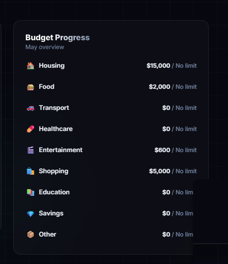
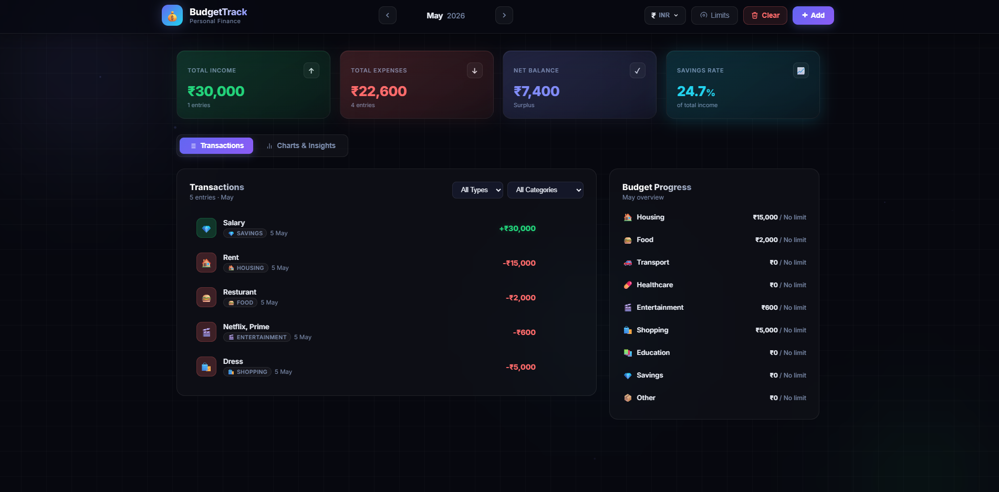
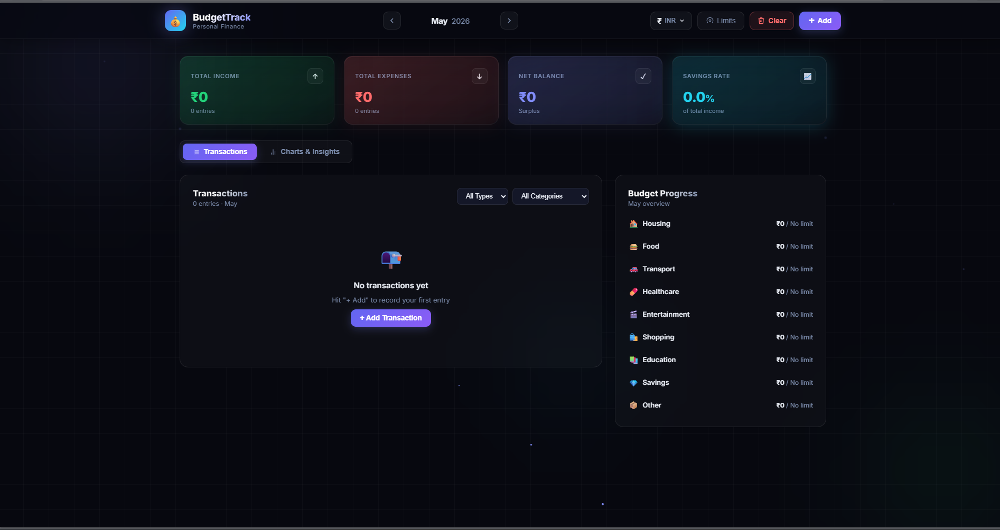
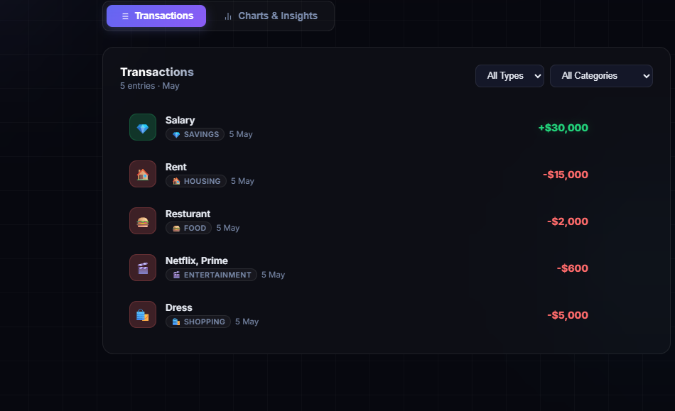

# Budget Maintenance

A modern web application for tracking and managing your personal budget with visual analytics and interactive dashboards.

## 📋 Table of Contents

- [Overview](#overview)
- [Features](#features)
- [Screenshots](#screenshots)
- [Tech Stack](#tech-stack)
- [Prerequisites](#prerequisites)
- [Installation](#installation)
- [Usage](#usage)
- [Project Structure](#project-structure)
- [Available Scripts](#available-scripts)
- [Troubleshooting](#troubleshooting)
- [Contributing](#contributing)
- [License](#license)

## Overview

Budget Maintenance is a React-based web application designed to help you track expenses, visualize spending patterns, and manage your personal budget efficiently. With an intuitive interface and powerful visualization tools powered by Recharts, you can easily monitor your financial health.

> 💱 **Multi-Currency Support**: Track your finances in any currency! Budget Maintenance supports multiple currency options, allowing you to manage your budget in your local currency or switch between different currencies seamlessly.

## ✨ Features

- 📊 Interactive dashboard with charts and graphs
- 💰 Expense tracking and categorization
- 📈 Budget visualization using Recharts
- 💵 Income and transaction tracking
- 📋 Detailed budget progress by category
- 🎯 Monthly spending analysis
- 💎 Net balance and savings rate calculation
- 💱 **Multi-Currency Support** - Use any currency for your budget
- ⚡ Lightning-fast development with Vite HMR
- 🎨 Modern React 19 architecture
- ✅ Code quality with ESLint
- 🚀 Optimized production builds

## 📸 Screenshots

### 1. Budget Progress Overview
View your monthly budget breakdown by category with spending limits and current expenses.



**Features:**
- Category-wise budget allocation
- Real-time spending status
- Multiple expense categories (Housing, Food, Transport, Healthcare, Entertainment, Shopping, Education, Savings, Other)
- Visual indicators for budget tracking

---

### 2. Dashboard - Main Interface
The complete dashboard showing income, expenses, net balance, and savings rate at a glance.



**Features:**
- **Total Income**: Track all income entries
- **Total Expenses**: Monitor total spending
- **Net Balance**: See your surplus/deficit
- **Savings Rate**: Calculate percentage of income saved
- **Transactions Tab**: View all transaction entries
- **Charts & Insights Tab**: Access visual analytics
- **Budget Progress**: Side panel with category breakdown
- **Month Navigation**: Switch between different months
- **Quick Actions**: Add, clear, and manage transactions
- **💱 Currency Selection**: Choose your preferred currency (INR, USD, EUR, GBP, JPY, AUD, CAD, and more)

---

### 3. Home Page (Empty State)
Clean home page interface ready to add your first transaction with currency selection options.



**Features:**
- Welcome state with financial summary cards
- Total income, expenses, net balance, and savings rate
- **💱 Multi-Currency Options**: Select from various currencies (INR, USD, EUR, GBP, JPY, AUD, CAD, CHF, CNY, SEK, NZD, and more)
- Budget progress sidebar
- Intuitive call-to-action to add your first transaction
- Month and currency selection dropdown
- Currency support for global users

---

### 4. Income Slip - Transaction History
Detailed list of all transactions made during the month with type and amount.



**Features:**
- Complete transaction history
- Transaction details (name, category, type, date, amount)
- Income entries (shown in green, with + prefix)
- Expense entries (shown in red, with - prefix)
- Filter by transaction type
- Filter by expense category
- Transaction date and timestamps
- All amounts displayed in your selected currency

---

## 🛠️ Tech Stack

| Technology | Version | Purpose |
|-----------|---------|---------|
| React | 19.2.4 | UI Framework |
| React DOM | 19.2.4 | React rendering |
| Vite | 8.0.0 | Build tool & dev server |
| Recharts | 3.8.0 | Data visualization |
| ESLint | 9.39.4 | Code linting |
| Node.js | 16+ | Runtime environment |
| npm | 8+ | Package manager |

## 📦 Prerequisites

Before you begin, ensure you have the following installed on your system:

### Required Software

1. **Node.js** (v16 or higher)
   - [Download Node.js](https://nodejs.org/)
   - Includes npm (Node Package Manager)

2. **Git** (optional, but recommended)
   - [Download Git](https://git-scm.com/)

### Verify Installation

Open your terminal/command prompt and verify installations:

```bash
# Check Node.js version
node --version
# Expected output: v16.0.0 or higher

# Check npm version
npm --version
# Expected output: 8.0.0 or higher

# Check Git version (if installed)
git --version
```

## 📥 Installation

Follow these step-by-step instructions to get Budget Maintenance running on your local machine.

### Step 1: Clone the Repository

#### Option A: Using Git (Recommended)

```bash
# Clone the repository
git clone https://github.com/Ohm1101/Budget_Maintenance.git

# Navigate to the project directory
cd Budget_Maintenance
```

#### Option B: Download ZIP

1. Go to [https://github.com/Ohm1101/Budget_Maintenance](https://github.com/Ohm1101/Budget_Maintenance)
2. Click the green **"Code"** button
3. Select **"Download ZIP"**
4. Extract the ZIP file
5. Open terminal/command prompt in the extracted folder

### Step 2: Verify Project Structure

Ensure your project folder contains these files:

```
Budget_Maintenance/
├── src/                    # Source code directory
├── public/                 # Static files
├── node_modules/           # Dependencies (created in Step 3)
├── .gitignore             # Git ignore rules
├── index.html             # HTML entry point
├── package.json           # Project configuration
├── package-lock.json      # Locked dependency versions
├── vite.config.js         # Vite configuration
├── eslint.config.js       # ESLint rules
└── README.md              # This file
```

### Step 3: Install Dependencies

Navigate to the project directory and install all required packages:

```bash
# Install dependencies
npm install
```

**What happens:**
- npm reads `package.json`
- Downloads all dependencies listed
- Creates `node_modules/` folder
- Generates `package-lock.json` for consistency
- This may take 2-5 minutes depending on your internet speed

**Expected output:**
```
added X packages in Xs
```

### Step 4: Verify Installation

Confirm that all dependencies are installed correctly:

```bash
# List installed packages
npm list

# Or check specific packages
npm list react
npm list vite
npm list recharts
```

### Step 5: Create Environment Configuration (Optional)

If needed, create a `.env` file in the root directory:

```bash
# Create .env file (Linux/Mac)
touch .env

# Create .env file (Windows - PowerShell)
New-Item -Path ".env"
```

Add any environment variables:

```env
VITE_API_URL=http://localhost:3000
VITE_APP_NAME=Budget Maintenance
```

## 🚀 Usage

### Start Development Server

Run the development server with Hot Module Replacement (HMR):

```bash
npm run dev
```

**Output:**
```
VITE v8.0.0  ready in XXX ms

➜  Local:   http://localhost:5173/
➜  press h to show help
```

**Access the app:**
- Open your browser and go to `http://localhost:5173/`
- The app automatically reloads when you save changes

**Stop the server:**
- Press `Ctrl + C` (Windows/Linux) or `Cmd + C` (Mac) in the terminal

### Build for Production

Create an optimized production build:

```bash
npm run build
```

**Output:**
```
✓ 1234 modules transformed.
✓ built in 5.32s
```

**Build artifacts:**
- Generated in `dist/` folder
- Minified and optimized for deployment
- Ready for production servers

### Preview Production Build

Test the production build locally:

```bash
# First, build the project
npm run build

# Then preview the build
npm run preview
```

**Output:**
```
➜  Local:   http://localhost:4173/
```

### Run Code Quality Checks

Check for code quality issues:

```bash
npm run lint
```

**Fixes linting issues automatically:**

```bash
npm run lint -- --fix
```

## 📁 Project Structure

```
Budget_Maintenance/
│
├── src/                          # Source code
│   ├── components/              # React components
│   ├── pages/                   # Page components
│   ├── App.jsx                  # Main App component
│   └── main.jsx                 # Entry point
│
├── public/                      # Static assets
│   └── favicon.ico             # Website favicon
│
├── screenshots/                 # Screenshots for documentation
│   ├── 1-budget-progress.png
│   ├── 2-dashboard.png
│   ├── 3-home-page.png
│   └── 4-income-slip.png
│
├── dist/                        # Production build (created after build)
│
├── node_modules/               # Dependencies (auto-generated)
│
├── .gitignore                  # Git ignore rules
├── index.html                  # HTML template
├── package.json               # Project metadata & scripts
├── package-lock.json          # Locked dependency versions
├── vite.config.js            # Vite build configuration
├── eslint.config.js          # ESLint configuration
├── .env                       # Environment variables (if created)
└── README.md                  # This file
```

## 📋 Available Scripts

All commands should be run from the project root directory:

| Command | Purpose |
|---------|---------|
| `npm run dev` | Start development server with HMR |
| `npm run build` | Create optimized production build |
| `npm run preview` | Preview production build locally |
| `npm run lint` | Check code quality with ESLint |
| `npm run lint -- --fix` | Auto-fix linting issues |

## 📋 App Functionality Guide

### Home Page
The landing page of the application displaying a welcome message and quick navigation to all features. Shows financial summary cards with total income, expenses, net balance, and savings rate. Includes **currency selection** to choose your preferred currency for all transactions and reporting.

**Supported Currencies:**
- 💵 USD (US Dollar)
- 💶 EUR (Euro)
- 💷 GBP (British Pound)
- 💴 JPY (Japanese Yen)
- 💰 INR (Indian Rupee)
- 🇦🇺 AUD (Australian Dollar)
- 🇨🇦 CAD (Canadian Dollar)
- 🇨🇭 CHF (Swiss Franc)
- 🇨🇳 CNY (Chinese Yuan)
- 🇸🇪 SEK (Swedish Krona)
- 🇳🇿 NZD (New Zealand Dollar)
- And many more!

### Budget Page
View your overall budget progress for the entire month. This page displays:
- Category-wise budget allocation
- Current spending in each category
- Budget limits per category
- Visual progress indicators
- Multiple expense categories: Housing, Food, Transport, Healthcare, Entertainment, Shopping, Education, Savings, and Other
- All amounts displayed in your selected currency

### Budget Table
Comprehensive breakdown of your monthly spending:
- Detailed expense entries in your chosen currency
- Categories for each transaction
- Spending amounts per category
- Total spending across all categories
- Real-time budget tracking
- Category-wise expense analysis
- Currency symbol automatically applied to all values

### Income Slip (Transaction History)
Complete transaction record showing all financial activities:
- All transactions made during the month
- Income entries (salary, bonus, etc.)
- Expense entries (rent, food, shopping, etc.)
- Transaction dates and timestamps
- Transaction types (income/expense)
- Category information for each transaction
- Filter options by type and category
- All transaction amounts in your selected currency

## 🔧 Development Workflow

### 1. **Local Development**

```bash
# Terminal 1: Start development server
npm run dev
```

Open `http://localhost:5173/` in your browser. The app will auto-reload when you save changes.

### 2. **Making Changes**

- Edit files in the `src/` directory
- Changes are reflected immediately in the browser (HMR)
- Check console for any errors

### 3. **Testing Your Changes**

```bash
# Check code quality
npm run lint

# Fix linting issues
npm run lint -- --fix
```

### 4. **Building for Production**

```bash
# Create optimized build
npm run build

# Preview the build
npm run preview
```

### 5. **Deploying**

The contents of the `dist/` folder can be deployed to:
- GitHub Pages
- Netlify
- Vercel
- Traditional web servers (Apache, Nginx)
- Cloud platforms (AWS, Azure, Google Cloud)

## ❓ Troubleshooting

### Issue: "command not found: npm"

**Solution:**
- Node.js and npm are not installed
- Download and install from [nodejs.org](https://nodejs.org/)
- Restart your terminal

### Issue: "node_modules" folder is very large

**Solution:**
```bash
# Remove node_modules and reinstall
rm -rf node_modules package-lock.json  # Linux/Mac
rmdir /s node_modules                  # Windows

npm install
```

### Issue: Port 5173 is already in use

**Solution:**
```bash
# Use a different port
npm run dev -- --port 3000
```

### Issue: Changes not reflecting in browser

**Solution:**
```bash
# Hard refresh browser
Ctrl + Shift + R (Windows/Linux)
Cmd + Shift + R (Mac)

# Or restart dev server
# Press Ctrl + C, then run npm run dev again
```

### Issue: Build fails with errors

**Solution:**
```bash
# Clear cache and reinstall
npm cache clean --force
rm -rf node_modules package-lock.json
npm install
npm run build
```

### Issue: Linting errors

**Solution:**
```bash
# Auto-fix linting issues
npm run lint -- --fix
```

## 🤝 Contributing

Contributions are welcome! Here's how to contribute:

1. **Fork the repository**
   - Click the "Fork" button on GitHub

2. **Clone your fork**
   ```bash
   git clone https://github.com/YOUR_USERNAME/Budget_Maintenance.git
   ```

3. **Create a feature branch**
   ```bash
   git checkout -b feature/your-feature-name
   ```

4. **Make your changes**
   - Follow the code style
   - Run `npm run lint -- --fix` to maintain code quality

5. **Commit your changes**
   ```bash
   git commit -m "Add: description of your feature"
   ```

6. **Push to your fork**
   ```bash
   git push origin feature/your-feature-name
   ```

7. **Open a Pull Request**
   - Describe your changes
   - Link any related issues

## 📄 License

This project is open source and available under the **MIT License**. See the LICENSE file for more details.

## 👨‍💻 Author

Created and maintained by [Ohm1101](https://github.com/Ohm1101)

---

## 📞 Support

If you encounter any issues:

1. Check the [Troubleshooting](#troubleshooting) section
2. Search existing [GitHub Issues](https://github.com/Ohm1101/Budget_Maintenance/issues)
3. Create a new issue with detailed description and error messages

---

**Happy budgeting! 💰**
